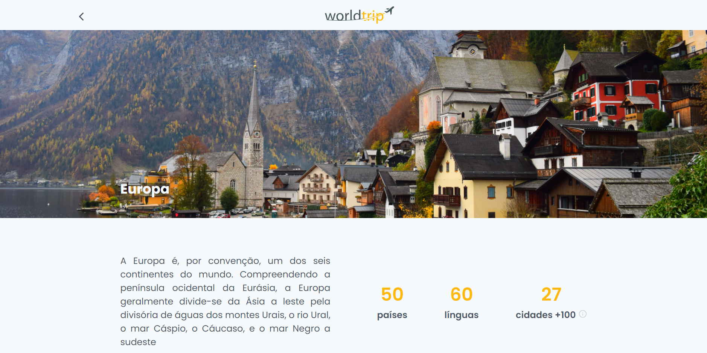

<p align="center">
  
</p>

<br />

<p align="left">
  <a href="https://www.linkedin.com/in/murilosambuite/"> 
    
  </a>
</p>

## :camera: Demo

<p align="center">
  
</p>

<p align="center">
  
</p>

<p align="center">
  
</p>

<p align="center">
  
</p>

<br />

## :hammer: Tools/Technologies

<em>This front-end features the latest tools and practices in web development!</em>

- **NextJS** — A React Framework (SSR and SSG)
- **Axios** — API requests
- **Chakra UI** — A component library
- **SASS** — CSS with superpowers
- **Swiper** — Slider/Swiper library

<br />

## :computer: Installation

### Step by step to run the application on your machine:

Clone this repository:

```
  git clone https://github.com/sambuite/worldtrip.git

  cd worldtrip
```

Run the following scripts:

```
  // Install the dependencies
  npm install

  // Start the application
  npm dev
```

or if you use yarn

```
  // Install the dependencies
  yarn

  // Start the application
  yarn dev
```

---

<br />

> Developed by <a href="https://github.com/sambuite" target="_blank">Murilo Sambuite</a> at [Rocketseat Ignite](https://www.rocketseat.com.br/ignite).

<br />

<a href="#top">Back to top</a>
